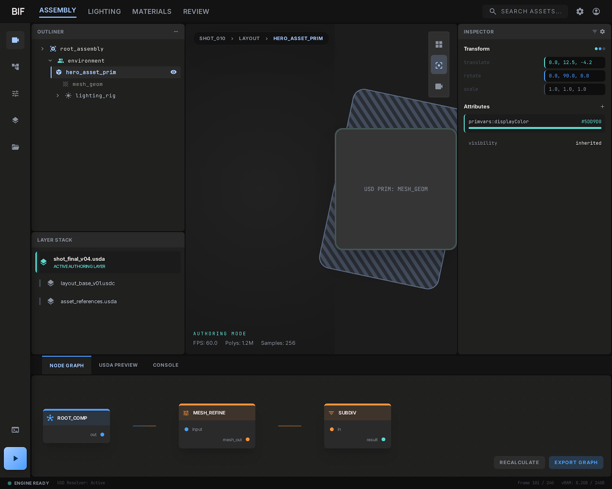
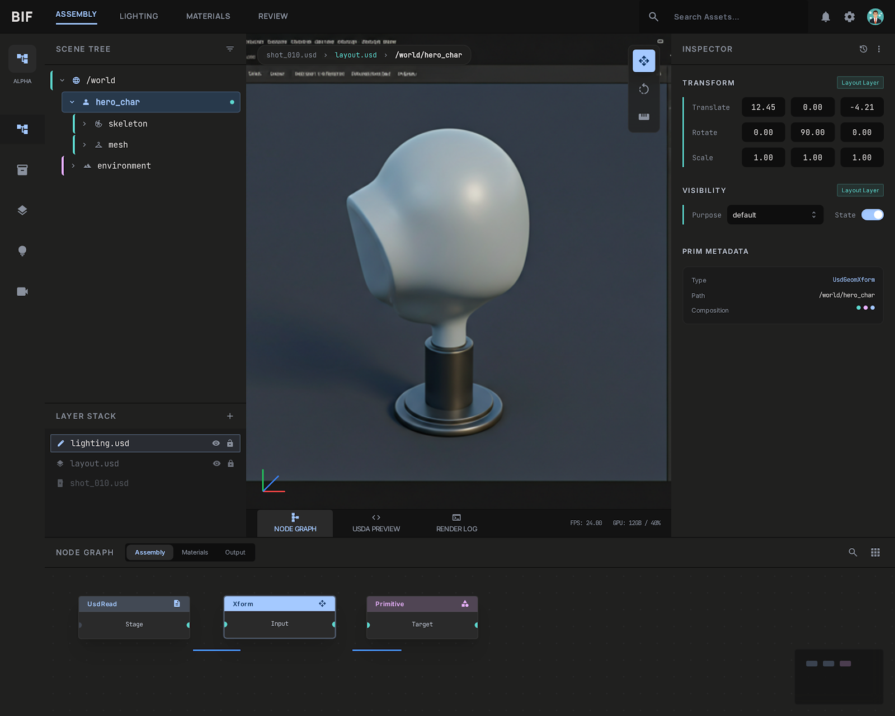
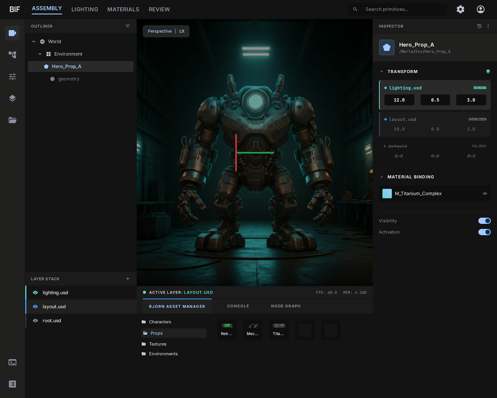
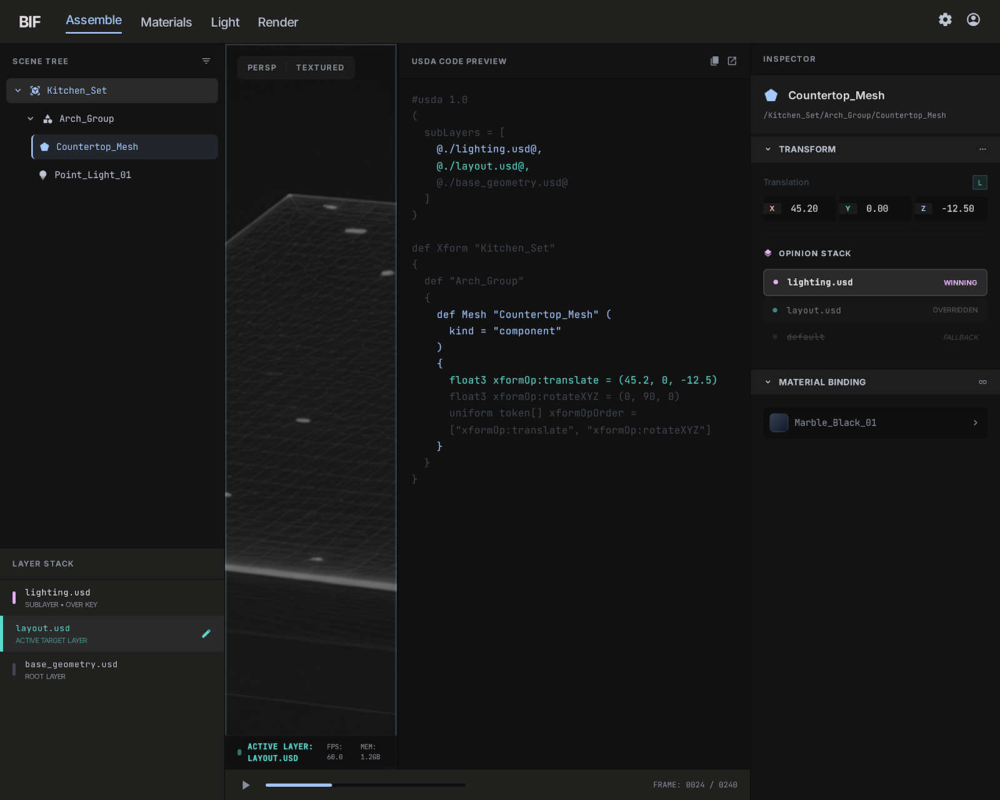
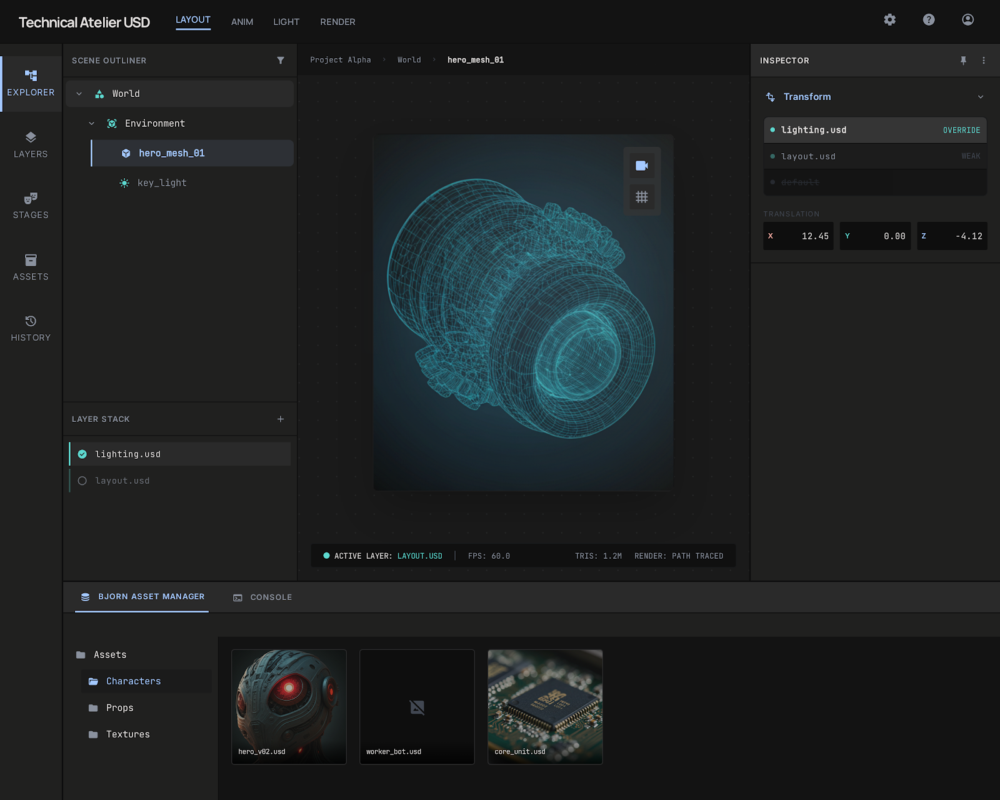
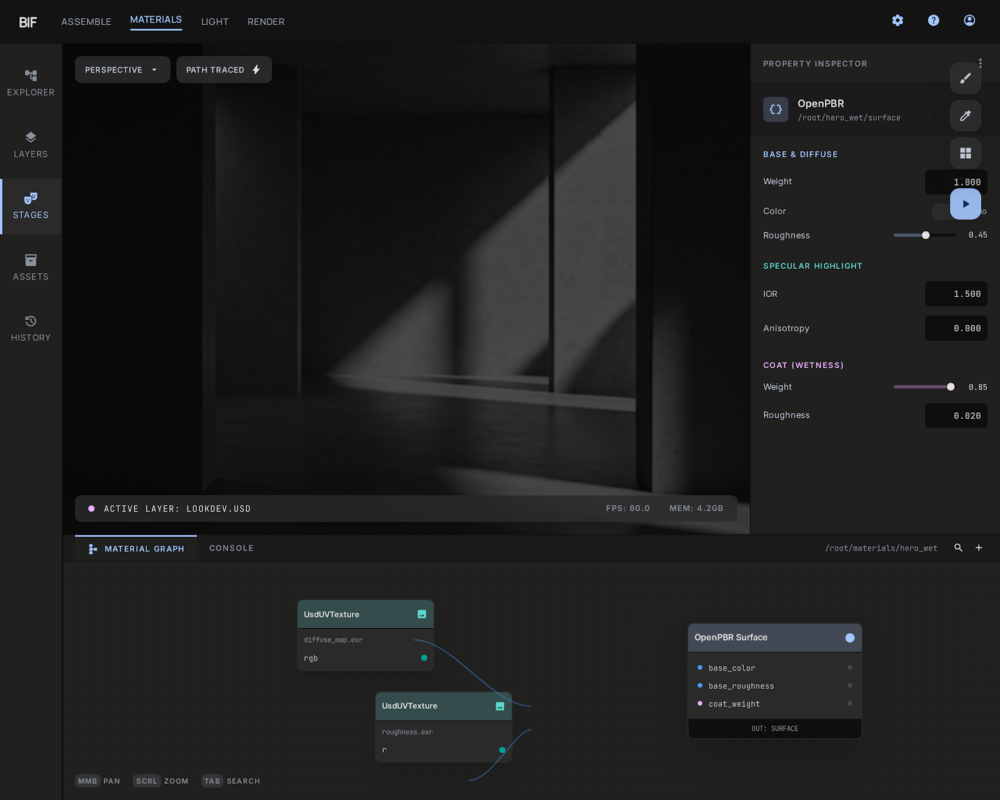
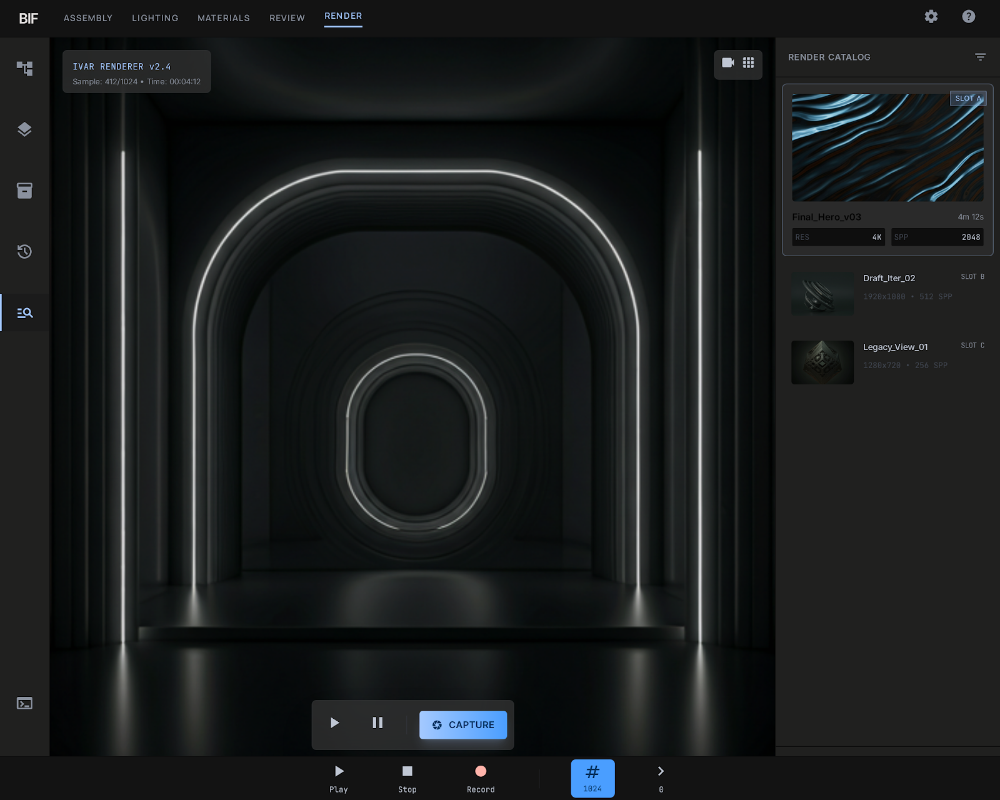
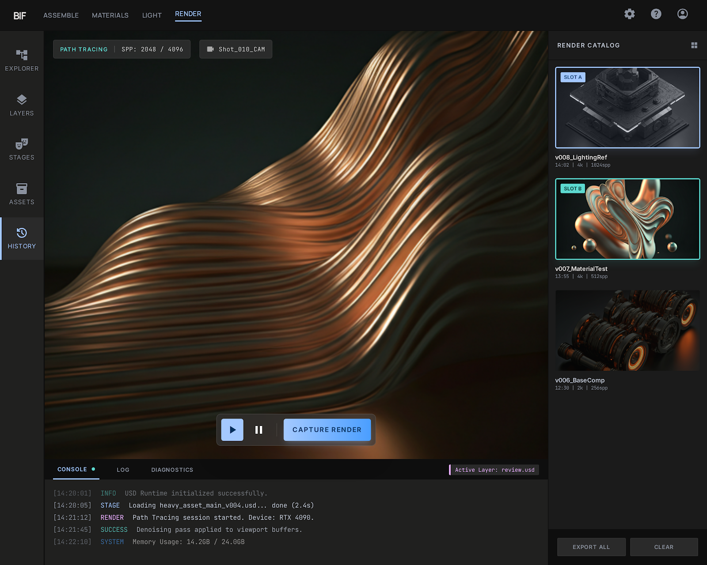

# BIF UI/UX Design Spec

**Status:** Authoritative pre-implementation spec for Qt migration
**Last updated:** 2026-03-31
**Design system:** [Obsidian Graphite / "Quiet Confidence"](../../assets/stitch_bif_ui/obsidian_graphite/DESIGN.md)
**Research:** [DCC_UI_RESEARCH.md](DCC_UI_RESEARCH.md)
**Reviews:** [UX_ARCHITECT_REVIEW.md](UX_ARCHITECT_REVIEW.md), [UX_RESEARCHER_REVIEW.md](UX_RESEARCHER_REVIEW.md) (findings incorporated below)

## Context

BIF's UI needs to make USD **visually understandable at a glance**. USD is already complex — layers, composition arcs, opinions, payloads — and no existing tool makes this intuitive. BIF's differentiator isn't just being a USD editor, it's being the tool where you *finally get* what USD is doing. Built for personal use, potentially open source. Sleek, modern, uncluttered — but power-user functional.

Current state: egui with 5 panels (left scene browser, right property inspector, top menu, bottom timeline, center viewport). Qt migration planned for v0.15.0.

---

## Reference Mockups

Generated via [Google Stitch](https://stitch.withgoogle.com/) in two batches.

### Batch 0 (`assets/stitch_bif_ui/`)

| Mockup | Image | Notes |
| -------- | ------- | ------- |
| Assembly Workspace (Qt) |  | Initial T-layout reference |
| Assembly Workspace (Detail) |  | Variation — inspector detail, breadcrumb bar |
| Lighting Workspace (Qt) |  | Initial lighting layout |
| Materials Workspace |  | Initial parameter sheet, shader graph |
| First Launch Screen |  | Onboarding: New/Open Stage, Recent Stages |

### Batch 1 (`assets/stitch_bif_ui_01/`) — addresses review gaps

| Mockup | Image | Notes |
| -------- | ------- | ------- |
| Assembly + Bjorn + Opinion Stack |  | Bjorn tab, opinion attribution in inspector, 3-layer stack |
| **Assembly + Vertical Code Split** |  | **Preferred layout** — USDA code alongside viewport, opinion stack visible |
| Assembly Unified |  | Bjorn thumbnails, labeled icon sidebar, full status bar |
| Lighting + Command Palette |  | Fuzzy search "Lgt_", light presets, USDA preview |
| Lighting + Code Preview |  | USDA code with line numbers, "ACTIVE LAYER" gold accent |
| Materials + Node Graph Safety |  | OpenPBR inspector, UsdUVTexture nodes, active layer indicator |
| Materials Unified |  | Carbon fiber material, texture preview, lookdev orb |
| Render + Path Tracing Catalog |  | Glassmorphic HUDs, Render Catalog slots, CAPTURE button |
| Render Workspace |  | Console logs, CAPTURE RENDER, active layer in status bar |

---

## Design Philosophy: "Quiet Confidence"

**Reference points:** Resolve's dark professionalism, Figma's clean panels, Blender 4.x's simplified toolbars, VS Code's command palette. NOT Houdini's parameter sprawl or Maya's toolbar overload.

**Core principle:** Show the *meaning* of USD, not the *mechanism*. Artists should understand composition through visual metaphors (colors, spatial relationships, icons) without reading USDA text.

---

## 1. Layout: Viewport-Dominant T-Layout

The workflow doc's three-panel-above-viewport is too cramped. Replace with **viewport-dominant dock layout**:

```text
┌────────────────┬──────────────────────────────────┬───────────────┐
│                │                                  │               │
│  SCENE TREE    │         V I E W P O R T          │  PROPERTIES   │
│  + Layer Stack │                                  │  + Opinion    │
│                │   (dominant — 60%+ of screen)    │    Inspector  │
│  [tree view]   │                                  │               │
│  [layers tab]  │                                  │  [context-    │
│                │                                  │   sensitive]  │
├────────────────┴──────────────────────────────────┴───────────────┤
│  NODE GRAPH | BJORN (Assets) | USDA PREVIEW | CONSOLE  [tabbed]   │
└────────────────────────────────────────────────────────────────── ┘
```

**Why this beats the spec's layout:**

- Viewport owns the center — this is a visual tool, not a code editor
- Left/right docks are narrow (250-300px) — just enough for tree + properties
- Bottom dock is **tabbed** — node graph, Bjorn asset manager, USDA preview, and console share space. You rarely need all three simultaneously
- Matches Clarisse, Katana, Blender, Nuke — artists already know this pattern

**Panel behaviors:**

- All docks collapsible with single click (thin grab bar, not a button)
- Double-click dock edge → auto-fit to content width
- `Tab` key cycles bottom dock tabs
- `Ctrl+\` toggles all docks (zen mode — viewport only)
- Panels remember size per-session

**Panel sizing (canonical, from mockup review):**

| Panel | Min Width/Height | Default | Collapse Threshold |
| ------- | ----------------- | --------- | ------------------- |
| Left dock (tree + layers) | 220px | 20% of window | Drag below 100px → collapse |
| Right dock (inspector) | 280px | 25% of window | Drag below 140px → collapse |
| Bottom dock (expanded) | 180px height | 30% of window height | — |
| Bottom dock (collapsed) | 32px height | Tab bar only | — |
| Viewport | 400x300px min | Fills remaining | Never collapses |

- 4px drag handle on collapsed bottom dock with hover state (`surface_container_high` on hover)
- Double-click splitter → restore default proportions
- Per-workspace proportion memory (Assembly remembers separately from Lighting)
- Snap-to-collapse: drag below threshold and panel collapses entirely

### Layout Variant: Vertical Code Split (Assembly)

An alternative Assembly layout placing USDA Code Preview alongside the viewport. **User-preferred layout** — validated by [`assemble_vertical_code_split_opinion_stack`](../../assets/stitch_bif_ui_01/assemble_vertical_code_split_opinion_stack/screen.png).

```text
┌──────────┬──────────────────┬──────────────┬───────────┐
│          │                  │              │           │
│  SCENE   │  USDA CODE       │  VIEWPORT    │ INSPECTOR │
│  TREE    │  PREVIEW         │  (~50%)      │ + Opinion │
│  +       │  (syntax-colored │              │   Stack   │
│  LAYERS  │   by layer)      │              │           │
│          │                  │              │           │
├──────────┴──────────────────┴──────────────┴───────────┤
│  ACTIVE LAYER indicator bar                            │
└────────────────────────────────────────────────────────┘
```

**When to use:** Debugging composition, learning USD, correlating code with visual result.

**Activation:** Command palette ("Split: Code + Viewport") or toolbar toggle. Bottom dock hides in this variant — its tabs (Node Graph, Bjorn, Console) move to a secondary tab bar within the code panel, or restore by collapsing the split.

**Code panel features:**

- Syntax-highlighted USDA with layer-colored file paths (e.g., `lighting.usd` paths in layer's teal)
- Line numbers visible
- Read-only in v0.15, editable in v0.16+
- Auto-scrolls to selected prim's definition
- Opinion stack indicators inline ("lighting.usd WINNING" annotations)

---

## 2. Making USD Visually Understandable

This is the core innovation. Three systems working together:

### A. Layer Color Coding (the "paint" metaphor)

Every layer gets an auto-assigned color from an 8-color palette:

| Layer | Color | Hex |
| ------- | ------- | ----- |
| Layout | Teal | `#4ecdc4` |
| Animation | Purple | `#9b59b6` |
| FX | Orange | `#e67e22` |
| Lighting | Gold | `#f1c40f` |
| Materials | Pink | `#e84393` |
| Custom 1-3 | Blue/Green/Red | varies |

These colors appear **everywhere** consistently:

- **Scene tree**: Tiny colored dot (6px) next to each prim showing which layer has the strongest opinion
- **Property inspector**: 3px colored left-border on each property row showing which layer set it
- **Viewport**: Optional colored wireframe overlay showing layer ownership
- **Viewport status bar**: Active layer name displayed in its assigned color (always visible)
- **Node graph**: Node header color matches its target layer, small layer badge pill
- **USDA preview**: Syntax coloring by layer origin (not just keyword highlighting)

**The "aha" moment:** An artist looks at the property inspector and instantly sees "ah, the transform is gold (lighting) but the material is pink (materials dept) and visibility is teal (layout)." No need to understand `GetPrimStack()` — the colors tell the story.

**Redundant encoding (critical for accessibility):** Never rely on color alone. Pair color with text weight so the system survives color vision deficiency (~8% of males):

| State | Left Border Color | Text Weight | Text Color | When |
| ------- | ------------------- | ------------- | ------------ | ------ |
| Set on active layer | `secondary` (#5dd9d0) | **Bold** | `on-surface` (#e5e2e1) | Your changes |
| From sublayer | `primary-container` (#4a9eff) | Regular | `on-surface-variant` (#c0c7d4) | Another layer's opinion |
| Default/fallback | `outline-variant` (#414752) | Regular | `outline` (#8a919e) | No opinion, using USD default |
| Overridden by stronger | `orange` (#e8a838) | Regular | `orange` (#e8a838) | Your value loses to a stronger layer |
| Muted layer | `outline-variant` | Regular | `outline` + strikethrough | From a muted/hidden layer |

**Human-readable labels:** Inspector shows friendly names with technical names in tooltip:

| Show | Instead of | Tooltip |
| ------ | ----------- | --------- |
| Mesh | UsdGeomMesh | `UsdGeomMesh` |
| Position | xformOp:translate | `xformOp:translate` |
| Material | material:binding | `material:binding` |
| Rect Light | UsdLuxRectLight | `UsdLuxRectLight` |

### B. Opinion Stack Visualization (the "layer cake")

When you select a prim, the property inspector shows a **mini layer stack** per property:

```text
Transform                    [gold dot] (12, 0.5, 3)
  └─ layers: lighting ■ layout ■ (2 opinions)
     click to expand ▸

Material Binding             [pink dot] /mtls/hero_wet
  └─ single opinion (materials layer)

Visibility                   [teal dot] inherited
  └─ no override — using default
```

Expanding shows the full opinion stack:

```text
Transform                    [gold dot] (12, 0.5, 3)  ← WINNING
  ├─ lighting.usd   ■ (12, 0.5, 3)    [strongest]
  ├─ layout.usd     ■ (10, 0, 3)      [weaker]
  └─ (default)        (0, 0, 0)        [fallback]
```

**Key insight:** Collapsed by default (clean), expandable on demand (powerful). Most artists just need to see the winning value + which layer owns it.

### C. Node Graph: Blue/Orange + Layer Awareness

Nodes already have blue (composition) vs orange (operation) color coding from the spec. Add:

- **Layer badge**: Small colored pill on each node showing which layer it targets
- **Flow visualization**: Animated dots flowing along connections when evaluation is happening
- **Ghosted nodes**: Nodes targeting non-active layers are 40% opacity (layer isolation)
- **"What changed" mode**: Toggle to dim all nodes except those that modified the current selection

### D. Active Layer Safety System

**Editing the wrong layer corrupts production work.** This is the highest-consequence UX failure in a layer-aware USD editor. The active layer indicator is a safety mechanism, not a cosmetic choice.

**Required safeguards (must exist in ALL workspaces):**

| Mechanism | Description | Location |
| ----------- | ------------- | ---------- |
| **Persistent status bar** | Layer name in layer's assigned color, always visible | Viewport bottom status bar |
| **Layer-switch toast** | "Now editing: lighting.usd (42 opinions)" | Top-center overlay, 3s auto-dismiss |
| **New-opinion guard** | Subtle amber icon when creating first opinion on a prim for this layer | Property row, left of value |
| **Layer lock icons** | Non-active layers show lock. Reorder requires confirmation | Layer Stack panel |
| **Viewport edge tint** | 2px colored stripe along viewport top edge matching active layer | Viewport frame |

---

## 3. Bjorn Asset Manager

**Bjorn** (following the Norse naming convention alongside Ivar renderer) is BIF's built-in asset browser and manager, accessible as a tab in the bottom dock alongside Node Graph, USDA Preview, and Console.

**Core features:**

- Browse and search USD assets on disk or from asset resolver paths
- Drag-and-drop assets into the scene tree or node graph to create references/payloads
- Thumbnail previews for `.usd`, `.usda`, `.usdc`, `.usdz` files
- Recent assets list, favorites/bookmarks
- Filter by asset type (geometry, materials, lights, environments)
- Integration with USD Asset Resolver for studio pipeline paths

**Tab behavior:**

- Lives in bottom dock as a peer tab to Node Graph, USDA Preview, Console
- In Assembly workspace: frequently used (artists pulling in assets)
- In Materials workspace: useful for browsing texture assets
- In Lighting/Render: rarely needed, tab available but not default

**Layout within tab:**

```text
┌──────────────────────────────────────────────────────┐
│ [Path bar: /assets/characters/]  [Search...] [Filter]│
├──────────────┬───────────────────────────────────────┤
│ Folders      │  Asset thumbnails (grid or list view) │
│ ├ characters │  [hero.usd] [sidekick.usd] [bg.usd]  │
│ ├ props      │                                       │
│ ├ materials  │  Drag to scene tree or node graph     │
│ └ environments│                                      │
└──────────────┴───────────────────────────────────────┘
```

---

## 4. Progressive Disclosure (Three Tiers)

### Tier 1 — Always Visible (the "glance")

- Scene tree with prim names + type icons + layer dots
- Selected prim's key properties (transform, material, visibility)
- Active layer indicator in viewport status bar
- Render progress (thin bar, not a dialog)

### Tier 2 — One Click Away

- Full property list for selected prim
- Layer stack panel (tab in left dock)
- Node graph (bottom dock tab)
- USDA code preview (bottom dock tab)
- Material thumbnail previews

### Tier 3 — Expert Mode

- Opinion stack expansion per property
- Composition arc visualization
- Raw USD attribute metadata
- Payload memory usage
- Per-prototype instance counts

---

## 5. Navigation: Command Palette + Breadcrumbs

### Command Palette (`Ctrl+P`)

Fuzzy-search everything:

- Prim paths: `/world/hero_char/body`
- Commands: `assign material`, `toggle visibility`
- Layers: `switch to lighting.usd`
- Node types: `add scatter node`
- Settings: `render quality`

This is the #1 feature for reducing clutter — anything that would need a toolbar button or menu item is also in the palette.

**Command Palette details (from lighting mockups):**

- **Fuzzy search:** Typing "Lgt_" filters to matching prims/commands. Results show prim name, USD type (e.g., "USD LUX - RECT LIGHT"), and category badge.
- **Result categories:** Each result has a type-specific icon and muted category label (USD Lux, Override, Render Settings).
- **Mode tabs:** Bottom of palette: NAVIGATE, ENTER, EXECUTE — filter results by intent.
- **Keyboard hints:** Bottom bar shows "Enter selects active", ESC to dismiss, arrow key navigation.
- **Overlay style:** Semi-transparent dark panel centered in viewport, ~400px wide. Glassmorphism (backdrop-blur, reduced opacity).
- **Scope awareness:** Results are contextual — Lighting workspace surfaces lights first, Materials workspace surfaces materials first.
- **Visible trigger:** "Search Assets... (Ctrl+P)" field in top bar teaches users the feature exists.

### Breadcrumb Bar (top of viewport)

Shows current context:

```text
shot_010.usd > lighting.usd (edit layer) > /world/hero_char (selected)
```

Each segment is clickable (switch stage, switch layer, navigate to prim).

### Workspace Presets

4 built-in layouts that reconfigure panels + payload policy:

- **Assembly**: Node graph prominent, all layers visible, LoadAll, Bjorn tab available
- **Lighting**: Viewport dominant, light properties, CameraFrustum loading, Console tab default
- **Materials**: Material editor + lookdev viewport, material layer active, shader graph prominent
- **Render**: Viewport maximized, Render Catalog, console/log dock, glassmorphic HUDs

Switch via `Ctrl+1/2/3/4` or workspace tabs in top bar.

---

## 6. Visual Design Language

### Color Palette

```text
Background:        #1c1c1c (not pure black — easier on eyes)
Panel background:  #252525
Panel border:      none — use 1px shadow gap (#111) between panels
Elevated surface:  #2d2d2d (floating menus, tooltips)
Primary text:      #d4d4d4 (not pure white — reduces glare)
Secondary text:    #808080
Accent (select):   #4a9eff (single blue, used sparingly)
Success:           #4ecdc4
Warning:           #f1c40f
Error:             #e74c3c
```

### Typography (refined from mockup review)

| Element | Font | Size | Weight | Case | Spacing |
| --------- | ------ | ------ | -------- | ------ | --------- |
| Workspace tabs | Manrope | 24px | 700 | UPPERCASE | 0.05em |
| Panel section headers | Inter | 11px | 700 | UPPERCASE | 0.05em |
| Property labels | Inter | 12px | 400 | Normal | 0 |
| Property values | JetBrains Mono | 13px | 400 | Normal | 0 |
| Tree items | Inter | 11px | 400 | Normal | 0 |
| Status bar | JetBrains Mono | 10px | 300 | Normal | 0.02em |
| Node labels | Inter | 10px | 700 | UPPERCASE | 0.02em |

**Key:** Workspace tabs must be visibly larger than panel section headers — establishes navigation hierarchy.

### Spacing & Shape

- 6px border radius on input fields, buttons, cards
- 8px padding inside panels
- 4px gap between list items
- No visible panel borders — shadow gaps only (Resolve style)
- 24px minimum click target (accessibility)

### Contrast Corrections (from mockup review)

| Element | Minimum Color | Ratio vs Background |
| --------- | -------------- | --------------------- |
| Status bar text | #8a919e | 4.5:1 (AA pass) |
| Inactive layer items | #8a919e + regular weight | 4.5:1 (AA pass) |
| Inactive bottom dock tabs | #8a919e | 4.5:1 (AA pass) |
| Primary text (labels) | #d4d4d4 | 10.5:1 (AA pass) |
| Active/selected text | #e5e2e1 | 14:1 (AA pass) |

**Never use pure white (#ffffff)** for text — causes halation. Use `on-surface` (#e5e2e1) max.
**Support global UI scale** (100%, 125%, 150%) for 4K displays and accessibility.

### Micro-interactions

- Panel collapse: 150ms ease-out slide
- Selection highlight: 100ms fade-in
- Layer dot color: instant (no animation — it's state, not action)
- Hover tooltips: 400ms delay (don't flash on mouse movement)
- Workspace switch: start instant, add 200ms animation as polish pass

---

## 7. Canonical Component Specs

### Layer Stack Widget (left dock tab)

```text
┌─ Layers ──────────────────────┐
│                               │
│  ■ lighting.usd    [eye] [✎] │  ← active (highlighted)
│  ■ fx.usd          [eye] [ ] │  ← visible but locked
│  ■ animation.usd   [eye] [ ] │  ← visible but locked
│  ■ layout.usd      [eye] [ ] │  ← visible but locked
│                               │
│  Drag to reorder strength     │
│  [+ Add Layer]                │
└───────────────────────────────┘
```

- Colored squares match the layer palette
- Eye icon = mute/unmute (like Photoshop)
- Pencil icon = set as edit target
- Active layer has subtle glow/highlight
- Drag reorder changes sublayer strength (with confirmation)

### Viewport Status Bar (bottom of viewport)

```text
lighting.usd (edit) │ 12,847 tris │ 1.2M instances │ Ivar: 64 spp │ ██████░░ 
```

Single line. No chrome. Just the facts.

### Material Preview Cards

In property inspector when a material is selected:

```text
┌──────────────────────┐
│  ┌──────┐            │
│  │ orb  │  hero_wet  │
│  │ prev │  OpenPBR   │
│  └──────┘            │
│  Base Color  #8B4513 │
│  Roughness   0.35    │
│  Metallic    0.0     │
│  IOR         1.5     │
│  [Edit Material ▸]   │
└──────────────────────┘
```

Thumbnail orb render + key params. Click to expand full material editor.
**Note (from review):** Material preview orb belongs in the inspector panel (above parameters), NOT floating in the viewport. Floating orb creates dual-attention conflict with the scene context.

### Scene Tree Items (canonical spec)

| Property | Value |
| ---------- | ------- |
| Row height | 22px (visual), 24px click target via padding |
| Indentation | 16px per level |
| Icon size | 14px, USD prim-type specific |
| Layer dot | 6px circle, 4px left of prim icon |
| Selected state | `surface_container_high` (#2a2a2a) bg, `primary` text |
| Disclosure triangle | 14px, `outline` color, rotates 90deg |
| Font | Inter, 11px, regular |
| Search bar | Top of panel, filter by name/type/layer |

**Icon set (same across ALL workspaces):** Mesh=`deployed_code`, Xform=`transform`, Scope=`folder_open`, Material=`palette`, Light=`light_mode`, Camera=`videocam`, PointInstancer=`scatter_plot`

### Node Graph Nodes (canonical spec)

| Property | Value |
| ---------- | ------- |
| Header height | 28px |
| Min width | 140px, snaps to 20px grid |
| Header colors | Composition=#4a9eff, Operation=#e8a838, Material=#9b59b6, Render=#5cb85c, Primitive=#8a919e |
| Body background | `surface_container_high` (#2a2a2a), NO border |
| Corner radius | `md` top on header, `md` bottom on body |
| Port circles | 10px, left=inputs, right=outputs |
| Port labels | JetBrains Mono 9px, visible when zoom > 80% |
| Selected state | 2px `primary_container` outline only |
| Layer badge | Small colored pill showing target layer |
| Warning badge | Top-right corner of header |

**These specs are canonical.** When mockups disagree, these win.

### Property Rows (type-driven formatting)

| USD Type | Widget | Min Width |
| ---------- | -------- | ----------- |
| GfVec3f/d (transform) | 3x input fields (X,Y,Z) | 240px |
| float/double | Slider + value field | 200px |
| bool | Toggle switch | 120px |
| SdfAssetPath | Text field + browse icon | 200px |
| GfVec3f (color) | Color swatch + value | 200px |
| TfToken (enum) | Dropdown | 160px |
| string | Text field | 200px |

All rows: 3px left-border (opinion color), `surface_container_lowest` input bg, no border, 1px `primary_container` glow on focus.

### Bottom Dock Tabs

| Property | Value |
| ---------- | ------- |
| Tab bar height | 32px |
| Tab labels | Inter 10px, bold, UPPERCASE, 0.05em spacing |
| Active tab | `surface_container` bg, `primary` text, 2px top border |
| Inactive tab | No bg, `outline` (#8a919e) text |
| Sub-tabs (node filters) | Pill buttons (different style from outer tabs) |
| Tabs | Node Graph \| Bjorn \| USDA Preview \| Console |

### Icon Sidebar (left rail)

| Property | Value |
| ---------- | ------- |
| Width | 48px collapsed, 160px expanded |
| Icons | 32x32px touch target |
| Active icon | `primary` color, `surface_container_high` bg |
| Inactive icon | `outline` color, no bg |
| **Tooltips** | Tool name + keyboard shortcut (mandatory) |
| **Collapsible** | Default collapsed for experts, expanded on first launch |
| **Labels** | Visible in expanded state |

---

## 8. Workspace Configurations

Each workspace reconfigures panels, default tabs, and payload policies.

### Assembly

**Canonical mockups:** [`assemble_bjorn_opinion_stack`](../../assets/stitch_bif_ui_01/assemble_bjorn_opinion_stack/screen.png) (standard T-layout), [**`assemble_vertical_code_split_opinion_stack`**](../../assets/stitch_bif_ui_01/assemble_vertical_code_split_opinion_stack/screen.png) (code split — preferred), [`assemble_workspace_unified`](../../assets/stitch_bif_ui_01/assemble_workspace_unified/screen.png) (labeled icon sidebar)

- **Left dock:** Scene Tree (expanded) + Layer Stack (expanded)
- **Right dock:** Inspector with full opinion attribution
- **Bottom dock:** Node Graph tab active, Bjorn + USDA Preview + Console available
- **Viewport:** Breadcrumb bar, tool HUD, status bar with layer indicator
- **Payload policy:** BoundingBoxOnly
- **Node graph filter:** All node types
- **Alternate layout:** Vertical code split — USDA preview replaces left portion of viewport (see Section 1 Layout Variant). Activate via command palette or toolbar toggle.
- **Icon sidebar:** Left rail with Explorer, Layers, Stages, Assets, History (labeled when expanded, icon-only when collapsed)

### Lighting

**Canonical mockups:** [`lighting_command_palette_updated`](../../assets/stitch_bif_ui_01/lighting_command_palette_updated/screen.png), [`light_command_palette_code_preview`](../../assets/stitch_bif_ui_01/light_command_palette_code_preview/screen.png)

- **Left dock:** Collapsed by default, contains filtered light list (UsdLux prims only)
- **Right dock:** Light-specific inspector (Intensity, Exposure, Color Temp, Shadows, Samples). Optional "LAYERS (HIERARCHICAL)" panel below properties showing all stage layers with active highlighted.
- **Bottom dock:** USDA Preview tab active (showing light definition code with line numbers), Console + Graph tabs available. "BAKE LIGHTING" action button at bottom-right.
- **Viewport:** Dominant (~70%), render mode badge ("PERSPECTIVE | PATH TRACED"), status bar with layer indicator
- **Active layer:** "ACTIVE LAYER: LIGHTING.USD" gold/amber accent bar
- **Payload policy:** CameraFrustum

### Materials

**Canonical mockups:** [`materials_node_graph_safety`](../../assets/stitch_bif_ui_01/materials_node_graph_safety/screen.png) (primary — node graph + safety), [`materials_workspace_unified`](../../assets/stitch_bif_ui_01/materials_workspace_unified/screen.png) (texture preview)

- **Left dock:** Scene Tree (same component as Assembly, filtered to material-relevant prims)
- **Right dock:** Property Inspector with OpenPBR section grouping (BASE & DIFFUSE, SPECULAR HIGHLIGHT, COAT, EMISSION). Material instance name prominent. Optional texture preview panel for selected texture input.
- **Bottom dock:** Material Graph tab active. Node types: UsdUVTexture, OpenPBR Surface. Graph toolbar: SNAP, PAN, GRID, ZOOM, TAB SEARCH. Larger vertical allocation (50/50 split option).
- **Viewport:** Scene context, material applied in-situ, PATH TRACED toggle
- **Active layer:** "ACTIVE LAYER: LOOKDEV.USD" gold/amber accent bar
- **Payload policy:** Selected asset only

### Render

**Canonical mockups:** [`render_workspace_updated`](../../assets/stitch_bif_ui_01/render_workspace_updated/screen.png) (primary), [`render_path_tracing_catalog`](../../assets/stitch_bif_ui_01/render_path_tracing_catalog/screen.png) (catalog detail)

- **Left dock:** Collapsed (icon sidebar only)
- **Right dock:** Render Catalog panel — thumbnail grid of saved renders with slot labels (Slot A, B, C), resolution badges (4K, 2048), timestamps. Selected slot has cyan highlight border.
- **Bottom dock:** Console tab active with render log output (timestamped: INFO, STAGE, RENDER, SUCCESS, SYSTEM). LOG and DIAGNOSTICS sub-tabs available. EXPORT ALL and CLEAR buttons.
- **Viewport:** Maximized, path-traced rendering active
- **Viewport HUDs (glassmorphic):** Top-left badges: engine + version ("IVAR RENDERER v2.4"), sample count ("SPP: 2048/4096"), elapsed time, active camera. Uses 70% opacity + backdrop-blur per design system.
- **Viewport controls:** Play / Pause / CAPTURE RENDER button bar (centered bottom). CAPTURE uses gradient primary button.
- **Payload policy:** LoadAll
- **Status bar visible** — "Active Layer: review.usd" always shown

**Render Catalog behavior:**

- Each capture creates a numbered slot with thumbnail, name, timestamp, resolution
- Slots selectable for A/B comparison ("Compare A/B" button)
- Right-click slot for export, rename, delete
- Thumbnails show miniature render previews

**Critical rule:** The scene tree is the SAME component in all workspaces. Never replace it with a project browser — filter/highlight instead.

---

## 9. BIF's Innovation Opportunities

Things no existing DCC does well that BIF can own:

1. **Layer-aware coloring everywhere** — No tool consistently color-codes layer ownership across all panels. This alone would make USD 10x more understandable.

2. **Live USDA preview** — Katana doesn't show you the USD your edits produce. BIF does. For learning USD, this is invaluable.

3. **Workspace-driven payload loading** — Switching to "Lighting" workspace automatically adjusts what's loaded in memory. No manual payload toggling.

4. **Opinion stack on hover** — Hover a property, see instantly which layers contribute and who wins. No need to open a separate inspector.

5. **Command palette for USD** — No DCC has a VS Code-style palette. For a tool with deep functionality, this eliminates toolbar clutter entirely.

6. **Bjorn asset manager** — Integrated asset browser with drag-and-drop into scene tree/node graph. No context switch to a file browser. Thumbnail previews, favorites, asset resolver integration.

---

## 10. Decisions Made

- **Node graph**: Bottom dock tab, tabbed with Bjorn, USDA preview, console. Viewport stays dominant.
- **Input style**: Hybrid — command palette (`Ctrl+P`) + right-click context menus + minimal toolbar. Everything has a hotkey AND a mouse path.
- **USD clarity**: All three systems (layer coloring, opinion stack, live USDA) are equally important and work as a unified system.
- **Asset manager**: Named "Bjorn" (Norse naming convention alongside Ivar). Lives as bottom dock tab.
- **Layer safety**: Active layer indicator must be visible in ALL workspaces. Non-negotiable.
- **Scene tree consistency**: Same component in all workspaces. Never replaced by project browser.
- **Opinion encoding**: Redundant — color + font weight. Never color alone.
- **Material preview**: In inspector panel, not floating in viewport.
- **Icon sidebar**: Collapsible, with tooltips showing shortcuts.
- **Workspace rename**: "Review" → **"Render"**. Mockups confirm active rendering workflow with catalog, console, capture controls.
- **Vertical code split**: Validated as Assembly layout variant. USDA code preview alongside viewport. User-preferred layout for composition debugging.
- **Render Catalog**: Right dock in Render workspace. Slot-based model (A/B/C) with thumbnails, resolution badges, timestamps. Replaces vague "A/B comparison" concept.
- **Command palette categories**: Results include type badges (USD Lux, Override, Render Settings) and mode tabs (Navigate, Enter, Execute). Not a flat text search.
- **First Launch screen**: Full-screen onboarding with New Stage / Open Stage cards and Recent Stages list. Doubles as "no stage open" empty state.
- **Icon sidebar labels**: Explorer, Layers, Stages, Assets, History. Text labels in expanded state, icon-only when collapsed.
- **Active layer gold accent**: "ACTIVE LAYER: ___" indicator uses gold/amber accent across all workspaces. Confirmed visually prominent in all batch 01 mockups.
- **Glassmorphic render HUDs**: Render workspace uses floating badges for engine version, sample count, elapsed time. Follows Glass & Gradient rule.

## 11. Resolved

1. **Multi-monitor** — Yes, design for pop-out panels from the start. Qt QDockWidget supports this natively.
2. **Scene tree at 100K+ prims** — Design for virtualized tree early. Don't retrofit.
3. **USDA code panel** — Read-only in v0.15, editable in v0.16+.
4. **Layer colors** — Both: auto-assigned defaults from palette + user/studio configurable override.

## 12. Implementation Phasing

| Idea | Target Release | Notes |
| ------ | --------------- | ------- |
| Layer color coding | v0.14 (egui proof-of-concept) → v0.15 (Qt full) | Core innovation — start early |
| Opinion attribution (redundant encoding) | v0.14 (basic) → v0.15 (full with bold/regular) | BIF's key differentiator |
| Opinion stack expansion | v0.14 (basic) → v0.16 (full hover) | Needs FFI for `GetPrimStack` |
| Active layer safety system | v0.14 (status bar) → v0.15 (full guards) | Non-negotiable for production use |
| Live USDA preview | v0.14 (basic text) → v0.15 (syntax highlighted) | Already in spec |
| T-layout with docks | v0.15 (Qt migration) | Can't do proper docking in egui |
| Command palette | v0.15 (Qt) | egui text input too limited |
| Bjorn asset manager | v0.15 (Qt, basic) → v0.16 (thumbnails, resolver) | Bottom dock tab |
| Workspace presets | v0.15 (basic) → v0.16+ (payload policies) | Panel configs per workspace |
| Breadcrumb bar | v0.15 (Qt) | Simple but needs proper toolbar |
| Human-readable labels | v0.15 (Qt) | Lookup table: USD type → friendly name |
| Icon sidebar with tooltips | v0.15 (Qt) | Collapsible, shortcuts in tooltips |
| Scene tree search/filter | v0.15 (Qt) | Essential for large stages |
| Micro-interactions | v0.15+ (Qt) | egui animation is primitive |
| Glassmorphism blur | v0.16+ (polish) | Progressive enhancement, start with solid |
| Render snapshot A/B | v0.16+ | Lighting workspace feature |

---

## 13. Missing Mockups Needed

Status after Stitch batch 01 — 7 of 11 covered, 4 remaining:

| Priority | Mockup | Status |
| ---------- | -------- | -------- |
| **P0** | Opinion stack expanded state | **COVERED** — `assemble_bjorn_opinion_stack`, `assemble_vertical_code_split_opinion_stack` |
| **P0** | Active layer indicator in all 4 workspaces | **COVERED** — visible in all batch 01 mockups (gold/amber accent bar) |
| **P1** | Command Palette overlay | **COVERED** — `lighting_command_palette_updated`, `light_command_palette_code_preview` |
| **P1** | USDA Code Preview tab content | **COVERED** — `assemble_vertical_code_split_opinion_stack`, `light_command_palette_code_preview` |
| **P1** | Bjorn asset manager tab | **COVERED** — `assemble_bjorn_opinion_stack`, `assemble_workspace_unified` |
| **P1** | Context menu (right-click) | **Still needed** — discoverability alongside command palette |
| **P1** | Render workspace | **COVERED** — `render_workspace_updated`, `render_path_tracing_catalog` |
| **P2** | Error states (failed USD load, broken reference) | **Still needed** — production resilience |
| **P2** | 15+ node complex graph | **Still needed** — validate scalability and LOD behavior |
| **P2** | Tooltip design | **Still needed** — specified in design system, never visualized |
| **P2** | First-launch onboarding | **COVERED** — `first_launch_screen` |

---

## 14. Qt Implementation Notes

### Straightforward

- Shadow gaps: `QSplitter::setHandleWidth(2)` + handle styled to `#0e0e0e`
- Gradient sliders: `QSlider::groove` stylesheet supports `qlineargradient`
- Surface hierarchy: Single Qt stylesheet constants file
- Font bundling: Bundle JetBrains Mono, fall back to Cascadia Code → Consolas → system mono

### Moderate Effort

- Node graph: `QGraphicsView` + `QGraphicsScene`, `SmartViewportUpdate`, LOD via `levelOfDetailFromTransform()`. Budget 2-3 weeks.
- Workspace switching: Save/restore `QSplitter` sizes per workspace. Start instant, add 200ms animation later.
- Scene tree virtualization: Only render visible rows. Essential for 100K+ prim stages.
- Bjorn: `QTreeView` (folders) + `QListView` with icon mode (thumbnails). `QFileSystemModel` for disk browsing, custom model for asset resolver paths.

### Complex / Progressive Enhancement

- Glassmorphism blur: Offscreen buffer + blur compositing. Fall back to 85% opacity solid.
- USDA code preview: `QScintilla` or `QPlainTextEdit` with custom syntax highlighter. Layer-aware coloring needs per-layer highlight rules.
- Animated transitions: `QTimer`-based interpolation on `QSplitter::setSizes()`.

---

## 15. First Launch / Onboarding Screen

**Canonical mockup:** [`first_launch_screen`](../../assets/stitch_bif_ui/first_launch_screen/screen.png)

Full-screen modal shown on first launch or when no stage is open. Replaces the workspace entirely.

### Layout

```text
┌──────────────────────────────────────────────────┐
│                                                  │
│                     BIF                          │
│          PROFESSIONAL USD ORCHESTRATION           │
│                                                  │
│    ┌──────────────┐    ┌──────────────┐          │
│    │   + New Stage │    │  Open Stage  │          │
│    │   Initialize  │    │  Browse for  │          │
│    │   fresh USD   │    │  .usd files  │          │
│    └──────────────┘    └──────────────┘          │
│                                                  │
│  ─── RECENT STAGES ──────────── [Clear History]  │
│  /projects/stg/arch/int_RGB.usd    2 hours ago   │
│  /pipeline/assets/prop_hero.usd    3 days ago    │
│  /personal/sketches/lighting.usdz  5 days ago    │
│                                                  │
│   Documentation   Community   Settings           │
│                                     v0.15.0      │
└──────────────────────────────────────────────────┘
```

### Spec

| Element | Details |
| --------- | --------- |
| Headline | "BIF" — Manrope, ~48px, 700 weight |
| Subtitle | "PROFESSIONAL USD ORCHESTRATION" — uppercase, letter-spaced, `on-surface-variant` |
| Action cards | Two side-by-side on `surface_container` bg, `md` radius. Icon + title + description. Hover: elevate to `surface_container_high` |
| New Stage | Creates fresh USD layer hierarchy (root.usd + sublayers). Opens into Assembly workspace |
| Open Stage | System file browser filtered to `.usd`, `.usda`, `.usdc`, `.usdz` |
| Recent Stages | Full file path (JetBrains Mono) + relative timestamp. Click to open. "Clear History" link. Max 10 entries, scrollable |
| Footer links | Documentation, Community, Settings — with icons, `outline` text |
| Version string | Bottom-right, JetBrains Mono 10px, `outline` color |
| Dismiss | Disappears once a stage opens. Not shown again unless all stages closed |
| Background | `surface` (#131313) with subtle technical grid pattern (40px, 2% opacity white) |

### Design notes

- Cards follow no-line rule — tonal shift, no borders
- Headline is the largest text in the entire application
- This screen doubles as the "no stage open" state — always available via File > Close Stage
- USD hierarchy ghost watermark in background (subtle, decorative)

---

## 16. Design Principles (Quick Reference)

1. **Show meaning, not mechanism.** Colors and spatial metaphors over raw USD terminology.
2. **Layer safety is non-negotiable.** Active layer visible in every workspace, always.
3. **Progressive disclosure.** 20% visible by default, 80% one click away.
4. **Redundant encoding.** Color + weight. Never color alone.
5. **Viewport is king.** Maximize viewport real estate in every design decision.
6. **Workspace = task.** Each workspace hides irrelevant controls.
7. **No lines, only light.** Depth through tonal shifts and shadow gaps.
8. **Density for pros, clarity for beginners.** 22px tree rows, collapsible panels, search everywhere.

---

*This document is the authoritative UI spec. When implementing Qt UI, reference this + [DESIGN.md](../../assets/stitch_bif_ui/obsidian_graphite/DESIGN.md) for tokens. When creating new Stitch mockups, validate against this spec.*
